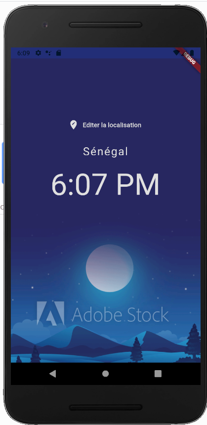
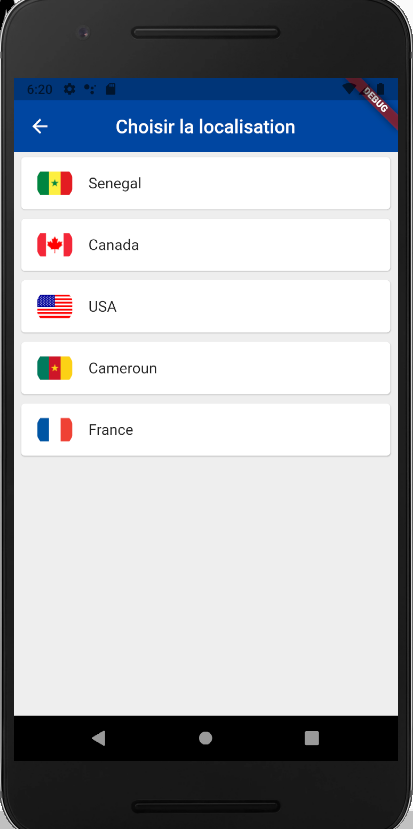
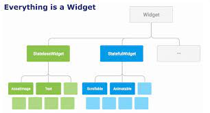

# Apprendre à développer des applications mobiles avec Flutter
## C'est quoi Fultter
- Mobile UI Framework pour créer des applications natives Android et IOS
- Baser sur un seul langage (DART)
## Motivation (Pourquoi Flutter?)
- Un seul langage de programmation à apprendre
- Bonne méthodologie de mise en page emprunté des applications web responsives
- Experience tres fluide et rapide
- Fonctionne parfaitement avec le backend de firebase
- Le langage DART est facile d'apprentissage
- Offre des Materiels Design tres evolués
- Tres bonne documentation
## Brief projet
### Présentation
Développement d'une application mobile qui a 3 fonctionnalités:
- Affichage de l'heure d'un pays par defaut associé avec une image de fond qui change selon qu'il fait jour ou nuit.
- Affichage d'une liste de pays avec le drapeau et nom.
- Affichage de l'heure du pays selectionné et qui est associé avec une image de fond qui change selon qu'il fait jour ou nuit.
### Outils
- Editeur: Visual Studio Code
- Emulateur : Android ou IOS
- API: http://worldtimeapi.org/timezones
### Resultats
#### Ecran 1

#### Ecran 2

#### Ecran 3


### Ce qu'il faut apprendre
- Classes
- Fonctions et methodes
- Variables
- Code asynchrone

### Environnement de développement
1. Installer Java JDK 11.0.10
2. Installer Android Studio
3. Installer Git
4. Installer Flutter: https://flutter.dev/docs/get-started/install
- Telecharger et decompresser le dans un dossier
- Ajouter Flutter dans le Path
## Les bases de Flutter
### Les widgets
#### Archiecture 

#### Exemple 

#### Catalogue des widgets
La liste des composants de base https://flutter.dev/docs/development/ui/widgets/basics
### Apprendre à code en DART
Se rendre ici https://dartpad.dev/?null_safety=true
#### Les variables
##### Affichage texte
```java
print('Bienvenue sur DART');
```
##### Declaration et affichage variable
```java
int x = 5;
print(x);
```
ou 
```java
int x = 5;
print('x = $x');
```
##### Casting interdit: conversion d'un String en int
```java
String s = 'Hello world';
s = 5;
print('s = $s');
```
##### Les booleens
```java
bool estJour = true;
print(estJour);
```
##### Eviter le casting interdit
```java
dynamic s = 'Bonjour';
s = 700;
print(s);
```
#### Les fonctions
##### Ecrire une fonction que retourne 'Hello tous'
- Declaration de la fonction
```java
String saluer(){
  return 'Hello tous ...';
}
```
- Appel de la fonction
```java
String msg = saluer();
print(msg);
```
##### Les fonctions flechées

- Declaration de la fonction
```java
String saluer() => 'Hello tous ...';
```
- Appel de la fonction
```java
String msg = saluer();
print(msg);
```
#### Les tableaux
##### Afficher un tableau de nom
```java
List noms = ['Ali', 'Fatou', 'Niatte', 'Lissa'];
print(noms);
```
##### Ajouter un nom à la fin du tableau
```java
List noms = ['Ali', 'Fatou', 'Niatte', 'Lissa'];
noms.add('Talla');
print(noms);
```
##### Retirer Niatte de la liste
```java
List noms = ['Ali', 'Fatou', 'Niatte', 'Lissa'];
noms.remove('Niatte');
print(noms);
```
##### Une liste peut etre hybride
```java
List noms = ['Ali', 'Fatou', 'Niatte', 'Lissa'];
noms.add(17);
print(noms);
```
##### Si la liste est de type String, pas possible d'y ajouter un int
```java
List<String> noms = ['Ali', 'Fatou', 'Niatte', 'Lissa'];
noms.add(17);   // Erreur
print(noms);
```
#### La POO

##### Declaration de la classe User
```java
class User {
  String nom = 'Fatou';
  int age = 34;
  
  void saluer(){
    print('Je suis $nom et j\'ai $age ans');
  }
}
```
##### Acces aux membres de la classe User
- Aux attributs
```java
String n = new User().nom;
```
ou
```java
String n = User().nom;
```
- Aux methodes

```java
User().saluer();
```
##### Constructeur
- Declaration
```java
class User {
  String nom = 'Fatou';
  int age = 23;
  
  User(String nom, int age){
    this.nom = nom;
    this.age = age;
  }
  
  void saluer(){
    print('Je suis $nom et j\'ai $age ans');
  }
}
```
- Appel

```java
User u = User('Ali', 34);
u.saluer();
```

##### Heritage
- Declaration
```java
class Apprenant extends User {
  String promo = 'P1';
  Apprenant(String nom, int age, String promo): super(nom, age){
    this.promo = promo;
  }
  
  void saluer(){
    super.saluer();
    print('Je suis de la promo $promo');
  }
}
```
- Appel
```java
Apprenant a = Apprenant('Ali', 34, 'P2');
a.saluer();
```
Si vous voulez approfondir, visiter https://dart.dev/guides.
## Demarrer Flutter
### Projet Flutter
1. Création du projet
```
$ flutter create world_time
```
2. Ajouter l'emulateur dans le path
```
PATH=;C:\Users\User\AppData\Local\Android\Sdk\emulator
```
3. Afficher la liste des emulateurs
```
$ emulator -list-avds
```
4. Demarrer l'emulateur
```
$ emulator @Nexus_6P_API_28
```
5. Demarrer le projet
```
$ cd create world_time
$ flutter run
```
### Modifier le programme
1. Editer main.dart
```java
import 'package:flutter/material.dart';

void main() => runApp(MaterialApp(
    home: Text('Bienvenue sur Flutter'),
  )
);

```
### Decouverte des widgets: Scaffold et AppBar
```java
import 'package:flutter/material.dart';

void main() => runApp(MaterialApp(
    home: Scaffold(
      appBar: AppBar(
        title: Text('Ma premiere application Flutter'),
        centerTitle: true,
      ),
      body: Text('Bienvenue sur Flutter'),
    )
));
```

### Centrer le corps
```java
import 'package:flutter/material.dart';

void main() => runApp(MaterialApp(
    home: Scaffold(
      appBar: AppBar(
        title: Text('Ma premiere application Flutter'),
        centerTitle: true,
      ),
      body: Center(
        child: Text('Bienvenue sur Flutter'),
      ),
    )
));
```
### Ajouter un bouton en bas à droite

```java
import 'package:flutter/material.dart';

void main() => runApp(MaterialApp(
    home: Scaffold(
      appBar: AppBar(
        title: Text('Ma premiere application Flutter'),
        centerTitle: true,
      ),
      body: Center(
        child: Text('Bienvenue sur Flutter'),
      ),
      floatingActionButton: FloatingActionButton(
        onPressed: (){},
        child: Text('Click'),
      ),
    )
));
```

### Couleurs et fonts
#### Changer la couleur de fond
1. Consulter les codes couleurs ici https://material.io/design/color/the-color-system.html#tools-for-picking-colors
2. Modifier la couleur de fond de l'AppBar et du Bouton
```java
import 'package:flutter/material.dart';

void main() => runApp(MaterialApp(
    home: Scaffold(
      appBar: AppBar(
        ...
        backgroundColor: Colors.amberAccent,
      ),
      body: Center(
        ...
      ),
      floatingActionButton: FloatingActionButton(
        ...,
        backgroundColor: Colors.amberAccent,
      ),
    )
));
```
### Augmenter la police du texte
```java
import 'package:flutter/material.dart';

void main() => runApp(MaterialApp(
    home: Scaffold(
      appBar: AppBar(
        ...
        backgroundColor: Colors.amberAccent,
      ),
      body: Center(
        child: Text(
          'Bienvenue sur Flutter',
          style: TextStyle(
            fontSize: 24.0
          ),
        ),
      ),
      floatingActionButton: FloatingActionButton(
        ...,
        backgroundColor: Colors.amberAccent,
      ),
    )
));
```
### Mettre le texte en gras
```java
import 'package:flutter/material.dart';

void main() => runApp(MaterialApp(
    home: Scaffold(
      appBar: AppBar(
        ...
        backgroundColor: Colors.amberAccent,
      ),
      body: Center(
        child: Text(
          'Bienvenue sur Flutter',
          style: TextStyle(
            fontSize: 24.0,
            fontWeight: FontWeight.bold
          ),
        ),
      ),
      floatingActionButton: FloatingActionButton(
        ...,
        backgroundColor: Colors.amberAccent,
      ),
    )
));
```
### Modifier le style du texte
```java
import 'package:flutter/material.dart';

void main() => runApp(MaterialApp(
    home: Scaffold(
      appBar: AppBar(
        ...
        backgroundColor: Colors.amberAccent,
      ),
      body: Center(
        child: Text(
          'Bienvenue sur Flutter',
          style: TextStyle(
            fontSize: 24.0,
            fontWeight: FontWeight.bold,
            letterSpacing: 2.0,
            color: Colors.grey[400]
          ),
        ),
      ),
      floatingActionButton: FloatingActionButton(
        ...,
        backgroundColor: Colors.amberAccent,
      ),
    )
));
```
### Modifier le fonts
La liste des fonts est disponible ici https://fonts.google.com/
1. Rechercher indie flow
2. Telecharger et decompresser le style
3. Creer un dossier fonts et ajouter le fichier OpenSans-Regular.ttf
4. Editer le fichier pubspec.yaml
```
fonts:
     - family: Schyler
       fonts:
         - asset: fonts/OpenSans-Regular.ttf
```
5. Editer main.dart
```java
import 'package:flutter/material.dart';

void main() => runApp(MaterialApp(
    home: Scaffold(
      appBar: AppBar(
        ...
      ),
      body: Center(
        child: Text(
          'Bienvenue sur Flutter',
          style: TextStyle(
            ...,
            fontFamily: 'IndieFlower'
          ),
        ),
      ),
      floatingActionButton: FloatingActionButton(
        ...
      ),
    )
));
```

## Stateless et Hot Reload
### Stateless vs Statefull
- Stateless widgets
Les données du composant ne peuvent pas changer au fil du temps.
- Statefull widgets
Les donnés du composant peuvent changer au fil du temps.

### Creer un composant Home
1. Retourner le Scaffold
```java
class Home extends StatelessWidget {
  const Home({Key key}) : super(key: key);

  @override
  Widget build(BuildContext context) {
    return Scaffold(
      appBar: AppBar(
        title: Text('Ma premiere application Flutter'),
        centerTitle: true,
        backgroundColor: Colors.amberAccent,
      ),
      body: Center(
        child: Text(
          'Bienvenue sur Flutter',
          style: TextStyle(
            fontSize: 24.0,
            fontWeight: FontWeight.bold,
            letterSpacing: 2.0,
            color: Colors.grey[400],
            fontFamily: 'IndieFlower'
          ),
        ),
      ),
      floatingActionButton: FloatingActionButton(
        onPressed: (){},
        child: Text('Click'),
        backgroundColor: Colors.amberAccent,
      ),
    );
  }
}
```
2. Le main
```java
void main() => runApp(MaterialApp(
    home: Home()
));
```
3. Tester le Hot Reload

### Images et Assets
#### URL
```java
class Home extends StatelessWidget {
  const Home({Key key}) : super(key: key);

  @override
  Widget build(BuildContext context) {
    return Scaffold(
      appBar: AppBar(
        ...
      ),
      body: Center(
        child: Image(
          image: NetworkImage('https://www.naturephotographie.com/wp-content/uploads/2013/09/Libre-comme-lAir.jpg'),
        ),
      ),
      floatingActionButton: FloatingActionButton(
       ...
      ),
    );
  }
}
```
#### En local
1. Creer le dossier assets et copier les images
2. Editer pubspec.yaml
```
assets:
    - assets/goree.jpg
```
3. Editer main.dart
```java
class Home extends StatelessWidget {
  const Home({Key key}) : super(key: key);

  @override
  Widget build(BuildContext context) {
    return Scaffold(
      appBar: AppBar(
        ...
      ),
      body: Center(
        child: Image(
          image: AssetImage('assets/goree.jpg'),
        ),
      ),
      floatingActionButton: FloatingActionButton(
        ...
      ),
    );
  }
}
```
4. Si vous avez plusieurs images, editer pubspec.yaml
```
assets:
    - assets/
```
5. Autre methode
```java
class Home extends StatelessWidget {
  const Home({Key key}) : super(key: key);

  @override
  Widget build(BuildContext context) {
    return Scaffold(
      appBar: AppBar(
        ...
      ),
      body: Center(
        child: Image.asset('assets/goree.jpg'),
      ),
      floatingActionButton: FloatingActionButton(
        ...
      ),
    );
  }
}
```

6. Autre methode
```java
class Home extends StatelessWidget {
  const Home({Key key}) : super(key: key);

  @override
  Widget build(BuildContext context) {
    return Scaffold(
      appBar: AppBar(
        ...
      ),
      body: Center(
        child: Image.network('https://www.naturephotographie.com/wp-content/uploads/2013/09/Libre-comme-lAir.jpg'),
      ),
      floatingActionButton: FloatingActionButton(
        ...
      ),
    );
  }
}
```
### Buttons et Icons
#### Afficher l'icone voiture
```java
import 'package:flutter/material.dart';

void main() => runApp(MaterialApp(
    home: Home()
));

class Home extends StatelessWidget {
  const Home({Key key}) : super(key: key);

  @override
  Widget build(BuildContext context) {
    return Scaffold(
      appBar: AppBar(
        ...
      ),
      body: Center(
        child: Icon(
          Icons.airport_shuttle
        ),
      ),
      floatingActionButton: FloatingActionButton(
        ...
      ),
    );
  }
}
```
#### Colorier la voiture en bleue
```java
import 'package:flutter/material.dart';

void main() => runApp(MaterialApp(
    home: Home()
));

class Home extends StatelessWidget {
  const Home({Key key}) : super(key: key);

  @override
  Widget build(BuildContext context) {
    return Scaffold(
      appBar: AppBar(
        ...
      ),
      body: Center(
        child: Icon(
          Icons.airport_shuttle,
          color: Colors.blue,
        ),
      ),
      floatingActionButton: FloatingActionButton(
        ...
      ),
    );
  }
}
```

#### Augmenter la taille de la voiture
```java
import 'package:flutter/material.dart';

void main() => runApp(MaterialApp(
    home: Home()
));

class Home extends StatelessWidget {
  const Home({Key key}) : super(key: key);

  @override
  Widget build(BuildContext context) {
    return Scaffold(
      appBar: AppBar(
        ...
      ),
      body: Center(
        child: Icon(
          Icons.airport_shuttle,
          color: Colors.blue,
          size: 50
        ),
      ),
      floatingActionButton: FloatingActionButton(
        ...
      ),
    );
  }
}
```
### Ajouter un Bouton
```java
class Home extends StatelessWidget {
  const Home({Key key}) : super(key: key);

  @override
  Widget build(BuildContext context) {
    return Scaffold(
      appBar: AppBar(
        ...
      ),
      body: Center(
        child: RaisedButton(
          onPressed: () {},
          child: Text('Click Moi'),
        ),
      ),
      floatingActionButton: FloatingActionButton(
        ...
      ),
    );
  }
}
```
### Colorier le bouton en bleu claire
```java

class Home extends StatelessWidget {
  const Home({Key key}) : super(key: key);

  @override
  Widget build(BuildContext context) {
    return Scaffold(
      appBar: AppBar(
        ...
      ),
      body: Center(
        child: RaisedButton(
          onPressed: () {},
          child: Text('Click Moi'),
          color: Colors.lightBlue,
        ),
      ),
      floatingActionButton: FloatingActionButton(
        ...
      ),
    );
  }
}
```
NB: on peut remplacer RaisedButton par FlatButton
### Associer une icone à un bouton
```java

class Home extends StatelessWidget {
  const Home({Key key}) : super(key: key);

  @override
  Widget build(BuildContext context) {
    return Scaffold(
      appBar: AppBar(
        ...
      ),
      body: Center(
        child: RaisedButton.icon(
          onPressed: () {}, 
          icon: Icon(Icons.mail), 
          label: Text('Boite mail'),
          color: Colors.amber,
        ),
      ),
      floatingActionButton: FloatingActionButton(
        ...
      ),
    );
  }
}
```

### Associer une icone à un bouton
```java

class Home extends StatelessWidget {
  const Home({Key key}) : super(key: key);

  @override
  Widget build(BuildContext context) {
    return Scaffold(
      appBar: AppBar(
        ...
      ),
      body: Center(
        child: IconButton(
          onPressed: () {}, 
          icon: Icon(Icons.alternate_email), 
          color: Colors.amber,
        ),
      ),
      floatingActionButton: FloatingActionButton(
        ...
      ),
    );
  }
}
```
## Containers et Padding
### Creer un container, le colorier en grise et ecrire un message
```java
class Home extends StatelessWidget {
  const Home({Key key}) : super(key: key);

  @override
  Widget build(BuildContext context) {
    return Scaffold(
      appBar: AppBar(
        ...
      ),
      body: Container(
        color: Colors.grey[400],
        child: Text('Hello world'),
      ),
      floatingActionButton: FloatingActionButton(
       ...
      ),
    );
  }
}
```
### Redimensionner le container
#### Marge interne
```java
class Home extends StatelessWidget {
  const Home({Key key}) : super(key: key);

  @override
  Widget build(BuildContext context) {
    return Scaffold(
      appBar: AppBar(
        ...
      ),
      body: Container(
        padding: EdgeInsets.all(70),
        color: Colors.grey[400],
        child: Text('Hello world'),
      ),
      floatingActionButton: FloatingActionButton(
       ...
      ),
    );
  }
}
```
ou
```java
class Home extends StatelessWidget {
  const Home({Key key}) : super(key: key);

  @override
  Widget build(BuildContext context) {
    return Scaffold(
      appBar: AppBar(
        ...
      ),
      body: Container(
        padding: EdgeInsets.symmetric(vertical: 50, horizontal: 100),
        color: Colors.grey[400],
        child: Text('Hello world'),
      ),
      floatingActionButton: FloatingActionButton(
       ...
      ),
    );
  }
}
```
ou
```java
class Home extends StatelessWidget {
  const Home({Key key}) : super(key: key);

  @override
  Widget build(BuildContext context) {
    return Scaffold(
      appBar: AppBar(
        ...
      ),
      body: Container(
        padding: EdgeInsets.fromLTRB(70, 120, 30, 30),
        color: Colors.grey[400],
        child: Text('Hello world'),
      ),
      floatingActionButton: FloatingActionButton(
       ...
      ),
    );
  }
}
```
#### Marge interne
```java
class Home extends StatelessWidget {
  const Home({Key key}) : super(key: key);

  @override
  Widget build(BuildContext context) {
    return Scaffold(
      appBar: AppBar(
        ...
      ),
      body: Container(
        padding: EdgeInsets.fromLTRB(70, 120, 30, 30),
        margin: EdgeInsets.all(30),
        color: Colors.grey[400],
        child: Text('Hello world'),
      ),
      floatingActionButton: FloatingActionButton(
       ...
      ),
    );
  }
}
```

#### Le widgets Padding
```java
class Home extends StatelessWidget {
  const Home({Key key}) : super(key: key);

  @override
  Widget build(BuildContext context) {
    return Scaffold(
      appBar: AppBar(
        ...
      ),
      body: Padding(
        padding: EdgeInsets.all(50),
        child: Text('Hello world'),
      ),
      floatingActionButton: FloatingActionButton(
       ...
      ),
    );
  }
}
```